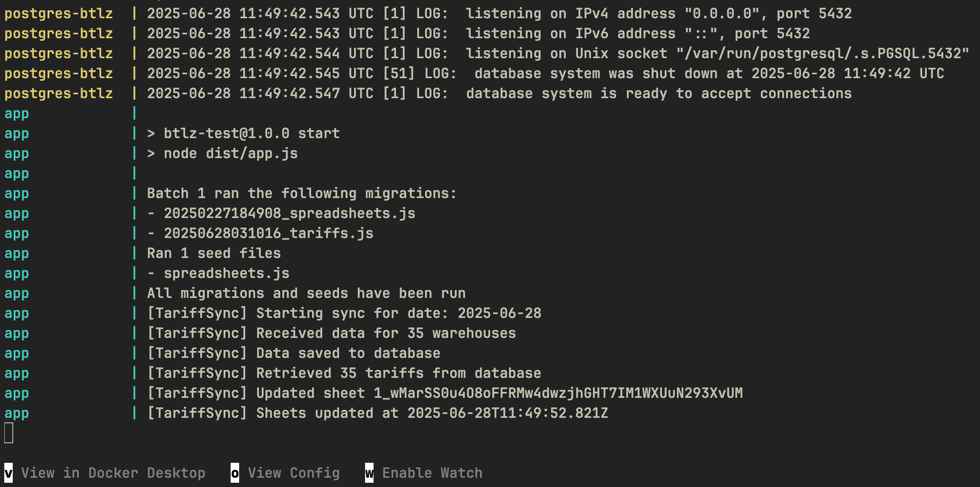

# Шаблон для выполнения тестового задания

## Описание
Шаблон подготовлен для того, чтобы попробовать сократить трудоемкость выполнения тестового задания.

В шаблоне настоены контейнеры для `postgres` и приложения на `nodejs`.  
Для взаимодействия с БД используется `knex.js`.  
В контейнере `app` используется `build` для приложения на `ts`, но можно использовать и `js`.

Шаблон не является обязательным!\
Можно использовать как есть или изменять на свой вкус.

Все настройки можно найти в файлах:
- compose.yaml
- dockerfile
- package.json
- tsconfig.json
- src/config/env/env.ts
- src/config/knex/config.ts

## Команды:

Запуск базы данных:
```bash
docker compose up -d --build postgres
```

Для выполнения миграций и сидов не из контейнера:
```bash
npm run knex:dev migrate latest
```

```bash
npm run knex:dev seed run
```
Также можно использовать и остальные команды (`migrate make <name>`,`migrate up`, `migrate down` и т.д.)

Для запуска приложения в режиме разработки:
```bash
npm run dev
```

Запуск проверки самого приложения:
```bash
docker compose up -d --build app
```

Для финальной проверки рекомендую:
```bash
docker compose down --rmi local --volumes
docker compose up --build
```

PS: С наилучшими пожеланиями!

## Запуск приложения

Скопируйте example.env и переименуйте в .env

### Google Sheets 

1. Через Google Cloud Console необходимо создать сервисный аккаунт и получить ключ.
2. Скаченный .json положить в корне проекта в папке secrets и назвать её по своему усмотрению, по умолчанию в example.env используется googlesheets.json, в случае всплеска фантазии необходимо поменять .env.
3. Создать нужные таблицы (https://docs.google.com/), скопировать их айди и вставить в .env через запятую.
4. Созданными таблицами поделиться с сервисным аккунтом по его сгенерированной почте и дать роль редактора.
5. Включить Google Sheets API в настройках проекта. В ином случае ошибка в консоли вежливо попросит это сделать и укажет ссылку.

### Wildberries

1. Получить ключ к API (если не знаете как – обратитесь к HR, мне помогло!).
2. В example.env по умолчанию указан путь к API, можно его не менять без необходимости.

### Запуск

Чтобы наверняка:

```bash
docker compose down --rmi local --volumes && docker compose up --build
```
Если уверены в себе:
```bash
docker compose up --build
```

В случае, если вы всё сделали правильно, в консоли увидите примерно следующее:



Для проверки работоспособности:
1. Подключиться к базе данных согласно данным из .env
2. Зайди в гугл таблицы, айди которых вы вставляли в .env

Удачного пользования!